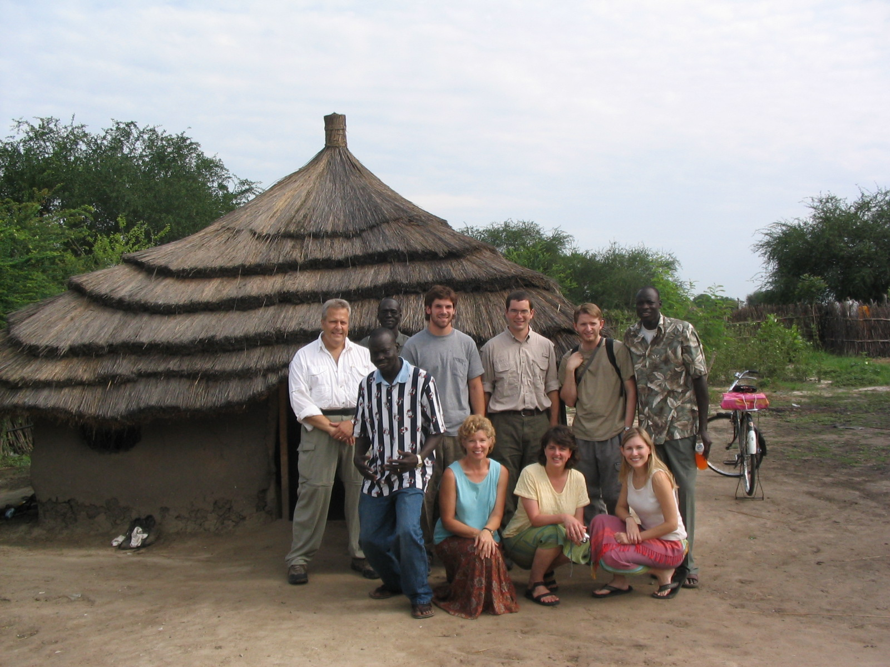
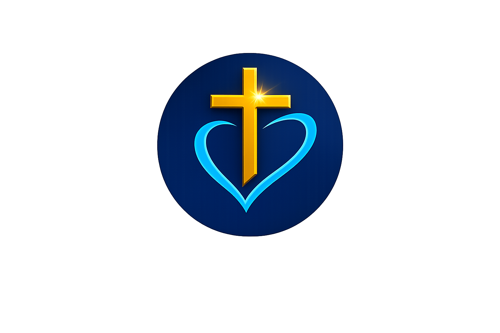
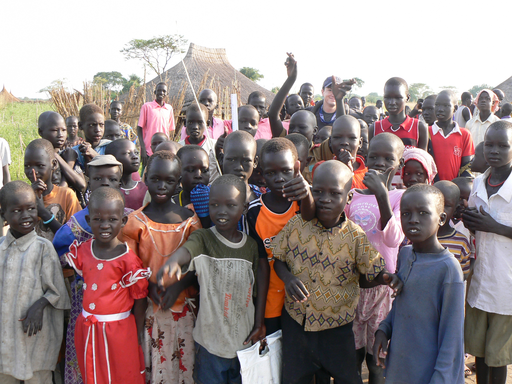
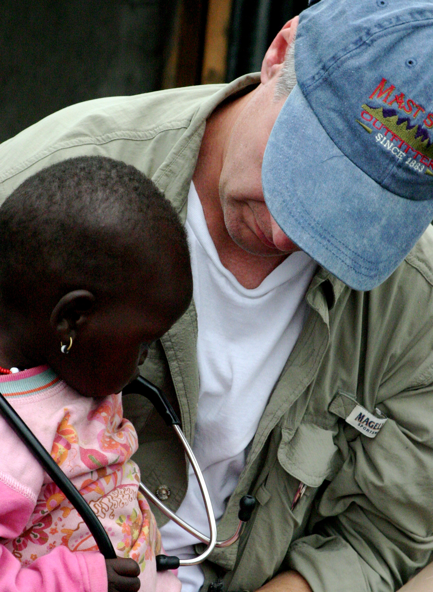
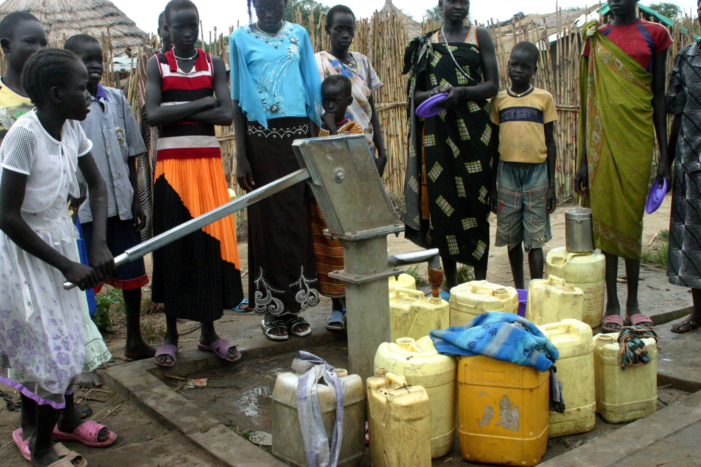
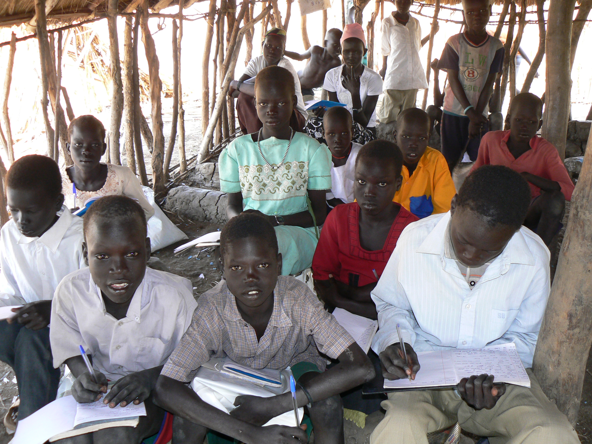

```{=html}
<!-- JSON-LD Organization Schema -->
<script type="application/ld+json">
{
  "@context": "https://schema.org",
  "@type": "NGO",
  "name": "Youth Evangelism Training (Y.E.T.) Compassion",
  "alternateName": "Y.E.T. Compassion",
  "url": "https://www.yetcompassion.org",
  "logo": "https://www.yetcompassion.org/images/logo.png",
  "description": "Y.E.T. Compassion equips South Sudanese diaspora youth with the Gospel of Christ and practical skills to lead with integrity, build stable families, and transform their communities.",
  "founder": {
    "@type": "Person",
    "name": "Evangelist Gai Bol Luom"
  },
  "foundingDate": "2006",
  "address": {
    "@type": "PostalAddress",
    "addressLocality": "Nashville",
    "addressRegion": "TN",
    "addressCountry": "US"
  },
  "sameAs": [
    "https://www.facebook.com/YetCompassion",
    "https://www.linkedin.com/in/gai-luom-155b83b3/"
  ]
}
</script>

<!-- ═══════════════════════════════════════════════ -->
<!-- HERO SLIDER                                     -->
<!-- ═══════════════════════════════════════════════ -->
<section id="hero-slider" style="position: relative; width: 100%; height: 55vh; min-height: 380px; max-height: 529px; overflow: hidden; background: #0d0d0d;">

  <!-- Background photo (swapped by JS) -->
  

  <!-- Refined overlay: lighter at top for photo visibility, focused center for text -->
  <div id="hero-overlay" style="position: absolute; inset: 0; background: linear-gradient(to bottom, rgba(0,0,0,0.15) 0%, rgba(0,0,0,0.4) 40%, rgba(0,0,0,0.5) 70%, rgba(0,0,0,0.65) 100%); z-index: 2;"></div>


  <!-- Hero content overlay -->
  <div id="hero-content" style="position: absolute; inset: 0; z-index: 4; display: flex; flex-direction: column; justify-content: center; align-items: center; padding: 1.5rem 1.5rem 3.5rem; text-align: center;">

    <!-- Year badge — compact, refined -->
    <div style="margin-bottom: 0.6rem;">
      <span id="hero-year" style="font-family: 'Inter', sans-serif; font-size: clamp(1rem, 2vw, 1.25rem); font-weight: 700; color: #D4A017; line-height: 1; display: inline-block; letter-spacing: 0.08em; padding: 0.3rem 0.9rem; border: 1px solid rgba(212,160,23,0.35); border-radius: 4px; backdrop-filter: blur(8px); background: rgba(0,0,0,0.25); transition: opacity 300ms ease;">2006</span>
      <span id="hero-caption" style="font-family: 'Inter', sans-serif; font-size: 0.65rem; font-weight: 500; letter-spacing: 0.15em; text-transform: uppercase; color: rgba(255,255,255,0.5); margin-top: 0.4rem; display: block; transition: opacity 300ms ease;">Mission begins</span>
    </div>

    <!-- Tagline — upright, authoritative -->
    <h1 style="font-family: 'Inter', sans-serif; font-style: normal; font-size: clamp(1.4rem, 3.2vw, 2.25rem); font-weight: 700; color: #FFFFFF; letter-spacing: -0.02em; line-height: 1.25; margin-bottom: 0.5rem; max-width: 680px; text-shadow: 0 1px 8px rgba(0,0,0,0.3);">
      Excellence is not what we aspire to — <span style="color: #D4A017; font-family: 'Playfair Display', Georgia, serif; font-style: italic;">it's what we deliver.</span>
    </h1>

    <!-- Photo description — subtle, secondary -->
    <p id="hero-desc" style="font-family: 'Inter', sans-serif; font-size: clamp(0.8rem, 1.4vw, 0.9rem); color: rgba(255,255,255,0.65); line-height: 1.5; max-width: 500px; margin: 0 auto 1rem; font-weight: 400; letter-spacing: 0.01em;">
      First mission team reaches Biong, South Sudan
    </p>

    <!-- CTAs — refined, frosted glass -->
    <div style="display: flex; gap: 0.6rem; justify-content: center; flex-wrap: wrap;">
      <a href="about/index.html" class="hero-cta-primary" style="display: inline-flex; align-items: center; padding: 0.45rem 1.4rem; font-family: 'Inter', sans-serif; font-size: 0.8rem; font-weight: 600; letter-spacing: 0.03em; color: #2B2B2B; background: #D4A017; border: none; border-radius: 4px; text-decoration: none; transition: all 250ms ease; box-shadow: 0 2px 8px rgba(212,160,23,0.3);">Learn More</a>
      <a href="donate.html" class="hero-cta-secondary" style="display: inline-flex; align-items: center; padding: 0.45rem 1.4rem; font-family: 'Inter', sans-serif; font-size: 0.8rem; font-weight: 600; letter-spacing: 0.03em; color: #FFFFFF; background: rgba(255,255,255,0.08); border: 1px solid rgba(255,255,255,0.25); border-radius: 4px; text-decoration: none; transition: all 250ms ease; backdrop-filter: blur(6px);">Donate Now</a>
    </div>
  </div>

  <!-- Bottom navigation bar — frosted glass strip -->
  <div id="hero-nav-bar" style="position: absolute; bottom: 0; left: 0; right: 0; z-index: 5; display: flex; align-items: center; justify-content: center; gap: 0.75rem; padding: 0.6rem 1rem; background: rgba(0,0,0,0.45); backdrop-filter: blur(12px); border-top: 1px solid rgba(255,255,255,0.08);">
    <button id="hero-prev" aria-label="Previous" style="width: 32px; height: 32px; border-radius: 50%; border: 1px solid rgba(255,255,255,0.15); background: transparent; color: #D4A017; font-size: 1rem; cursor: pointer; display: flex; align-items: center; justify-content: center; transition: all 200ms ease;">‹</button>

    <!-- Year pips -->
    <div id="hero-pips" style="display: flex; gap: 0.3rem; align-items: center;"></div>

    <!-- Progress dots -->
    <div style="width: 1px; height: 14px; background: rgba(255,255,255,0.12); margin: 0 0.2rem;"></div>
    <div id="hero-dots" style="display: flex; gap: 0.25rem; align-items: center;"></div>

    <button id="hero-next" aria-label="Next" style="width: 32px; height: 32px; border-radius: 50%; border: 1px solid rgba(255,255,255,0.15); background: transparent; color: #D4A017; font-size: 1rem; cursor: pointer; display: flex; align-items: center; justify-content: center; transition: all 200ms ease;">›</button>
  </div>
</section>

<script>
(function() {
  var data = [
    { year: '2006', caption: 'Mission begins', photos: [
      { src: 'images/project-images/biong-mission-team-2006.jpg', desc: 'First mission team reaches Biong, South Sudan', pos: 'center 65%' }
    ]},
    { year: '2007', caption: 'Mission Trip', photos: [
      { src: 'images/project-images/biong-women-carrying-water.png', desc: 'Women carrying water during the flood', pos: 'center 40%' },
      { src: 'images/project-images/biong-missionary-team-photo.png', desc: 'Mission team gathers in Biong during flood relief efforts', pos: 'center 35%' }
    ]},
    { year: '2008', caption: 'Education & community', photos: [
      { src: 'images/project-images/mission_trip_photos/biong_mission_trip_photos_06.JPG', desc: 'Community gathering during mission outreach', pos: 'center 50%' },
      { src: 'images/project-images/mission_trip_photos/biong_mission_trip_photos_03.jpg', desc: 'Volunteers building relationships with local families', pos: 'center 45%' },
      { src: 'images/project-images/2008_photos/classroom_photos-01.jpg', desc: 'Students engaged in learning under shelter', pos: 'center 45%' },
      { src: 'images/project-images/2008_photos/classroom_photos-04.jpg', desc: 'Community gathering under a tree for shared learning', pos: 'center 50%' },
      { src: 'images/project-images/2008_photos/classroom_photos-05.jpg', desc: 'Intergenerational partnership with local community members', pos: 'center 45%' },
      { src: 'images/project-images/devotion_photos/maker_manyang_devition_01.JPG', desc: 'Community gathered in prayer and worship', pos: 'center 50%' },
      { src: 'images/project-images/biong-women-with-food-aid.jpg', desc: 'Women collecting food supplies for their families', pos: 'center 20%' },
      { src: 'images/project-images/medical_supplies/medical_photos-01.jpg', desc: 'Distributing medicine and medical supplies to families', pos: 'center 40%' },
      { src: 'images/project-images/best_photos/best_pictures-03.jpg', desc: 'Youth raised in hope — celebrating community and faith', pos: 'center 45%' },
      { src: 'images/project-images/best_photos/best_pictures-05.jpg', desc: 'Building genuine connections with young people', pos: 'center 40%' },
      { src: 'images/project-images/best_photos/best_pictures-07.jpg', desc: 'Intergenerational respect and community authenticity', pos: 'center 45%' }
    ]},
    { year: '2009', caption: 'Clean water & relief', photos: [
      { src: 'images/project-images/biong-food-distribution-leader.jpg', desc: 'Food distribution reaching families in need', pos: 'center 35%' },
      { src: 'images/project-images/biong-children-at-well-site.jpg', desc: 'Children gather at the new well site', pos: 'center 45%' },
      { src: 'images/project-images/water_well_photos/water_well_photos_02.JPG', desc: 'Community accessing clean water from the new well', pos: 'center 50%' }
    ]},
    { year: '2012', caption: 'Education', photos: [
      { src: 'images/project-images/biong-school-building.jpg', desc: 'School construction completed in Biong', pos: 'center 50%' },
      { src: 'images/project-images/biong-teacher-with-students.jpg', desc: 'Teacher with students in the classroom', pos: 'center 35%' },
      { src: 'images/project-images/biong-students-with-textbooks.jpg', desc: 'Students receive new textbooks', pos: 'center 40%' }
    ]}
  ];

  var yearIdx = 0, photoIdx = 0, timer = null;
  var bg = document.getElementById('hero-bg');
  var yearEl = document.getElementById('hero-year');
  var captionEl = document.getElementById('hero-caption');
  var descEl = document.getElementById('hero-desc');
  var dotsEl = document.getElementById('hero-dots');
  var pipsEl = document.getElementById('hero-pips');
  var contentEl = document.getElementById('hero-content');
  var overlayEl = document.getElementById('hero-overlay');

  // Preload all images so transitions are instant
  data.forEach(function(g) {
    g.photos.forEach(function(p) {
      if (p.src) {
        var preload = new Image();
        preload.src = p.src;
      }
    });
  });

  // Build year pips
  data.forEach(function(g, i) {
    var pip = document.createElement('button');
    pip.textContent = g.year;
    pip.className = 'hero-pip';
    pip.style.cssText = 'font-family:Inter,sans-serif;font-size:0.6rem;font-weight:600;padding:0.15rem 0.45rem;border-radius:3px;border:1px solid rgba(255,255,255,0.12);background:transparent;color:rgba(255,255,255,0.4);cursor:pointer;transition:all 200ms ease;white-space:nowrap;letter-spacing:0.03em;';
    pip.addEventListener('click', function() { goToYear(i); });
    pipsEl.appendChild(pip);
  });

  function render() {
    var g = data[yearIdx];
    var p = g.photos[photoIdx];

    // Year label
    yearEl.style.opacity = '0';
    captionEl.style.opacity = '0';
    setTimeout(function() {
      yearEl.textContent = g.year;
      captionEl.textContent = g.caption;
      yearEl.style.opacity = '1';
      captionEl.style.opacity = '1';
    }, 150);

    bg.style.objectFit = 'cover';
    bg.style.objectPosition = p.pos || 'center 45%';
    bg.style.transform = 'scale(1.02)';

    bg.style.transition = 'none';
    bg.style.opacity = '0';
    bg.style.display = '';
    bg.style.objectPosition = p.pos || 'center 45%';
    bg.src = p.src;
    bg.alt = p.desc;
    setTimeout(function() {
      bg.style.transition = 'opacity 0.8s ease';
      descEl.textContent = p.desc;
      // Use requestAnimationFrame to ensure src is applied before fading in
      requestAnimationFrame(function() {
        requestAnimationFrame(function() {
          bg.style.opacity = '1';
        });
      });
    }, 300);

    // Dots
    dotsEl.innerHTML = '';
    if (g.photos.length > 1) {
      g.photos.forEach(function(_, i) {
        var dot = document.createElement('span');
        dot.style.cssText = 'width:6px;height:6px;border-radius:50%;transition:all 200ms ease;cursor:pointer;';
        dot.style.background = i === photoIdx ? '#D4A017' : 'rgba(255,255,255,0.25)';
        if (i === photoIdx) dot.style.boxShadow = '0 0 6px rgba(212,160,23,0.4)';
        dot.addEventListener('click', function() { photoIdx = i; render(); resetTimer(); });
        dotsEl.appendChild(dot);
      });
    }

    // Year pips
    Array.from(pipsEl.children).forEach(function(pip, i) {
      if (i === yearIdx) {
        pip.style.background = '#D4A017';
        pip.style.color = '#2B2B2B';
        pip.style.borderColor = '#D4A017';
        pip.style.boxShadow = '0 0 8px rgba(212,160,23,0.3)';
      } else {
        pip.style.background = 'transparent';
        pip.style.color = 'rgba(255,255,255,0.4)';
        pip.style.borderColor = 'rgba(255,255,255,0.12)';
        pip.style.boxShadow = 'none';
      }
    });
  }

  function advance() {
    var g = data[yearIdx];
    if (photoIdx < g.photos.length - 1) {
      photoIdx++;
    } else if (yearIdx < data.length - 1) {
      yearIdx++;
      photoIdx = 0;
    } else {
      yearIdx = 0;
      photoIdx = 0;
    }
    render();
  }

  function goBack() {
    if (photoIdx > 0) {
      photoIdx--;
    } else if (yearIdx > 0) {
      yearIdx--;
      photoIdx = data[yearIdx].photos.length - 1;
    } else {
      yearIdx = data.length - 1;
      photoIdx = data[yearIdx].photos.length - 1;
    }
    render();
  }

  function goToYear(i) {
    yearIdx = i;
    photoIdx = 0;
    render();
    resetTimer();
  }

  function resetTimer() {
    clearInterval(timer);
    timer = setInterval(advance, 5000);
  }

  document.getElementById('hero-next').addEventListener('click', function() { advance(); resetTimer(); });
  document.getElementById('hero-prev').addEventListener('click', function() { goBack(); resetTimer(); });

  render();
  timer = setInterval(advance, 5000);
})();
</script>

<style>
  .hero-cta-primary:hover {
    background: #d4ad2e !important;
    box-shadow: 0 4px 16px rgba(212,160,23,0.4) !important;
    transform: translateY(-1px);
  }
  .hero-cta-secondary:hover {
    background: rgba(255,255,255,0.15) !important;
    border-color: rgba(255,255,255,0.4) !important;
    transform: translateY(-1px);
  }
  #hero-prev:hover, #hero-next:hover {
    color: #D4A017 !important;
    border-color: rgba(212,160,23,0.4) !important;
    background: rgba(212,160,23,0.1) !important;
  }
  .hero-pip:hover {
    color: rgba(255,255,255,0.7) !important;
    border-color: rgba(255,255,255,0.3) !important;
  }
  @media (max-width: 640px) {
    #hero-slider { height: 50vh !important; min-height: 340px !important; }
    #hero-pips button { font-size: 0.5rem !important; padding: 0.12rem 0.3rem !important; }
    #hero-nav-bar { gap: 0.4rem !important; padding: 0.5rem 0.75rem !important; }
  }
</style>

<!-- ═══════════════════════════════════════════════ -->
<!-- OUR FOCUS — Honest pillars, no inflated stats  -->
<!-- ═══════════════════════════════════════════════ -->
<section style="background-color: #0B1F3B; padding: 2.25rem 1.5rem;">
  <div class="pillars-strip">
    <div class="pillar-item">
      <span class="pillar-icon">✝</span>
      <span class="pillar-label">Faith &amp; Discipleship</span>
    </div>
    <div class="pillar-divider"></div>
    <div class="pillar-item">
      <span class="pillar-icon">🎓</span>
      <span class="pillar-label">Leadership &amp; Mentorship</span>
    </div>
    <div class="pillar-divider"></div>
    <div class="pillar-item">
      <span class="pillar-icon">🏠</span>
      <span class="pillar-label">Family &amp; Empowerment</span>
    </div>
    <div class="pillar-divider"></div>
    <div class="pillar-item">
      <span class="pillar-icon">🤝</span>
      <span class="pillar-label">Community &amp; Diaspora</span>
    </div>
  </div>
</section>

<!-- ═══════════════════════════════════════════════ -->
<!-- MISSION STATEMENT                               -->
<!-- ═══════════════════════════════════════════════ -->
<section class="reveal-on-scroll" style="background-color: #FFFFFF; padding: 3.5rem 1.5rem;">
  <div style="max-width: 780px; margin: 0 auto; text-align: left;">
    <h2 style="font-family: 'Playfair Display', serif; font-size: clamp(1.75rem, 3vw, 2.5rem); color: #2B2B2B; margin-bottom: 1.25rem; font-weight: 600;">
      Our Mission
    </h2>
    <p style="font-family: 'Inter', sans-serif; font-size: 1.1rem; line-height: 1.8; color: #5A5955; margin-bottom: 1.25rem;">
      We walk alongside young people through discipleship, mentorship, and hands-on training — preparing them not just to survive, but to lead. Every program we build is grounded in Scripture and designed for lasting impact.
    </p>
    <p style="font-family: 'Inter', sans-serif; font-size: 1.1rem; line-height: 1.8; color: #5A5955; margin-bottom: 2rem;">
      What began in 2006 as grassroots mission work in South Sudan was formalized in 2025 when <strong>Evangelist Gai Bol Luom</strong> registered Y.E.T. Compassion as a nonprofit in Nashville, Tennessee, with IRS-approved 501(c)(3) tax-exempt status granted in 2026 — building on nearly two decades of faithful service to South Sudanese communities in the U.S.A., South Sudan, and beyond.
    </p>
    <a href="about/index.html" class="btn-green">Learn More About Our Work</a>
  </div>
</section>

<!-- ═══════════════════════════════════════════════ -->
<!-- PROGRAMS OVERVIEW                               -->
<!-- ═══════════════════════════════════════════════ -->
<section class="reveal-on-scroll" style="background-color: #F7F6F2; padding: 3.5rem 1.5rem;">
  <div style="max-width: 1200px; margin: 0 auto;">

    <div style="text-align: center; margin-bottom: 3rem;">
      <h2 style="font-family: 'Playfair Display', serif; font-size: clamp(1.75rem, 3vw, 2.5rem); color: #2B2B2B; margin-bottom: 0.75rem;">Our Programs</h2>
      <p style="font-family: 'Inter', sans-serif; font-size: 1.1rem; color: #5A5955; max-width: 600px; margin: 0 auto;">Five strategic focus areas designed to build faith, leadership, and community resilience.</p>
    </div>

    <div style="display: grid; grid-template-columns: 1fr; gap: 1.5rem;">

      <!-- Youth Evangelism -->
      <div class="program-card" style="background: #FFFFFF; border-radius: 12px; padding: 2rem; box-shadow: 0 1px 3px rgba(0,0,0,0.08); border-top: 4px solid #0B1F3B; text-align: center; transition: box-shadow 200ms ease, transform 200ms ease;">
        <div style="font-size: 2.5rem; margin-bottom: 0.75rem;">✝️</div>
        <h4 style="font-family: 'Inter', sans-serif; font-weight: 600; font-size: 1.15rem; color: #2B2B2B; margin-bottom: 0.75rem;">Youth Evangelism & Discipleship</h4>
        <p style="font-family: 'Inter', sans-serif; font-size: 0.95rem; color: #5A5955; line-height: 1.6; margin-bottom: 1rem;">Grounding young people in biblical truth through contextual teaching, Bible studies, and one-on-one discipleship.</p>
        <a href="programs/index.html#evangelism" style="color: #0B1F3B; font-weight: 600; text-decoration: none; font-size: 0.95rem;">Learn More →</a>
      </div>

      <!-- Leadership Development -->
      <div class="program-card" style="background: #FFFFFF; border-radius: 12px; padding: 2rem; box-shadow: 0 1px 3px rgba(0,0,0,0.08); border-top: 4px solid #D4A017; text-align: center; transition: box-shadow 200ms ease, transform 200ms ease;">
        <div style="font-size: 2.5rem; margin-bottom: 0.75rem;">🎓</div>
        <h4 style="font-family: 'Inter', sans-serif; font-weight: 600; font-size: 1.15rem; color: #2B2B2B; margin-bottom: 0.75rem;">Leadership Development & Mentorship</h4>
        <p style="font-family: 'Inter', sans-serif; font-size: 0.95rem; color: #5A5955; line-height: 1.6; margin-bottom: 1rem;">Cultivating servant leaders through structured mentorship, professional training, and public speaking workshops.</p>
        <a href="programs/index.html#leadership" style="color: #0B1F3B; font-weight: 600; text-decoration: none; font-size: 0.95rem;">Learn More →</a>
      </div>

      <!-- Family Empowerment -->
      <div class="program-card" style="background: #FFFFFF; border-radius: 12px; padding: 2rem; box-shadow: 0 1px 3px rgba(0,0,0,0.08); border-top: 4px solid #38BDF8; text-align: center; transition: box-shadow 200ms ease, transform 200ms ease;">
        <div style="font-size: 2.5rem; margin-bottom: 0.75rem;">🏠</div>
        <h4 style="font-family: 'Inter', sans-serif; font-weight: 600; font-size: 1.15rem; color: #2B2B2B; margin-bottom: 0.75rem;">Family Stability & Counseling</h4>
        <p style="font-family: 'Inter', sans-serif; font-size: 0.95rem; color: #5A5955; line-height: 1.6; margin-bottom: 1rem;">Strengthening families through counseling, financial literacy, and community retreats.</p>
        <a href="programs/index.html#family" style="color: #0B1F3B; font-weight: 600; text-decoration: none; font-size: 0.95rem;">Learn More →</a>
      </div>

      <!-- Community Building -->
      <div class="program-card" style="background: #FFFFFF; border-radius: 12px; padding: 2rem; box-shadow: 0 1px 3px rgba(0,0,0,0.08); border-top: 4px solid #0B1F3B; text-align: center; transition: box-shadow 200ms ease, transform 200ms ease;">
        <div style="font-size: 2.5rem; margin-bottom: 0.75rem;">🤝</div>
        <h4 style="font-family: 'Inter', sans-serif; font-weight: 600; font-size: 1.15rem; color: #2B2B2B; margin-bottom: 0.75rem;">Community Building & Diaspora Advocacy</h4>
        <p style="font-family: 'Inter', sans-serif; font-size: 0.95rem; color: #5A5955; line-height: 1.6; margin-bottom: 1rem;">Creating networks of support and advocating for diaspora communities with faith and purpose.</p>
        <a href="programs/index.html#community" style="color: #0B1F3B; font-weight: 600; text-decoration: none; font-size: 0.95rem;">Learn More →</a>
      </div>

      <!-- Homeland Engagement -->
      <div class="program-card" style="background: #FFFFFF; border-radius: 12px; padding: 2rem; box-shadow: 0 1px 3px rgba(0,0,0,0.08); border-top: 4px solid #D4A017; text-align: center; transition: box-shadow 200ms ease, transform 200ms ease;">
        <div style="font-size: 2.5rem; margin-bottom: 0.75rem;">🌍</div>
        <h4 style="font-family: 'Inter', sans-serif; font-weight: 600; font-size: 1.15rem; color: #2B2B2B; margin-bottom: 0.75rem;">Service & Mission in South Sudan</h4>
        <p style="font-family: 'Inter', sans-serif; font-size: 0.95rem; color: #5A5955; line-height: 1.6; margin-bottom: 1rem;">Connecting diaspora to homeland through mission trips, educational sponsorships, and community partnerships.</p>
        <a href="programs/index.html#homeland" style="color: #0B1F3B; font-weight: 600; text-decoration: none; font-size: 0.95rem;">Learn More →</a>
      </div>

    </div>
  </div>

  <style>
    .program-card:hover {
      box-shadow: 0 4px 16px rgba(0,0,0,0.12) !important;
      transform: translateY(-2px);
    }
    @media (min-width: 640px) {
      div[style*="grid-template-columns: 1fr;"][style*="gap: 1.5rem"] {
        grid-template-columns: repeat(2, 1fr) !important;
      }
    }
    @media (min-width: 1024px) {
      div[style*="grid-template-columns: 1fr;"][style*="gap: 1.5rem"] {
        grid-template-columns: repeat(3, 1fr) !important;
      }
    }
  </style>
</section>

<!-- ═══════════════════════════════════════════════ -->
<!-- SCRIPTURE BANNER                                -->
<!-- ═══════════════════════════════════════════════ -->
<section style="background-color: #2B2B2B; padding: 4rem 1.5rem; text-align: center;">
  <div style="max-width: 800px; margin: 0 auto;">
    <p style="font-family: 'Cormorant Garamond', Georgia, serif; font-style: italic; font-size: clamp(1.15rem, 2.5vw, 1.6rem); color: #D4A017; line-height: 1.7; margin: 0;">
      "For I know the plans I have for you, declares the Lord, plans to prosper you and not to harm you, plans to give you hope and a future."
    </p>
    <span style="font-family: 'Inter', sans-serif; font-size: 0.875rem; color: #8A8985; margin-top: 1rem; display: block;">
      — Jeremiah 29:11
    </span>
  </div>
</section>

<!-- ═══════════════════════════════════════════════ -->
<!-- CORE VALUES                                     -->
<!-- ═══════════════════════════════════════════════ -->
<section class="reveal-on-scroll" style="background-color: #FFFFFF; padding: 3.5rem 1.5rem;">
  <div style="max-width: 900px; margin: 0 auto;">

    <h2 style="font-family: 'Playfair Display', serif; font-size: clamp(1.75rem, 3vw, 2.5rem); color: #2B2B2B; text-align: center; margin-bottom: 3rem;">Our Core Values</h2>

    <ul style="list-style: none; padding: 0; margin: 0;">

      <li style="padding: 1.25rem 0; border-bottom: 1px solid #D9D8D4; display: flex; gap: 1rem; align-items: flex-start;">
        <span style="font-family: 'Playfair Display', serif; font-size: 1.5rem; font-weight: 700; color: #0B1F3B; min-width: 2rem; line-height: 1.3;">1</span>
        <div>
          <strong style="color: #2B2B2B; font-size: 1.05rem;">Scriptural Foundation</strong>
          <span style="color: #5A5955;"> — Truth begins with the Word. All our work is grounded in biblical principles and the transformative power of the Gospel.</span>
        </div>
      </li>

      <li style="padding: 1.25rem 0; border-bottom: 1px solid #D9D8D4; display: flex; gap: 1rem; align-items: flex-start;">
        <span style="font-family: 'Playfair Display', serif; font-size: 1.5rem; font-weight: 700; color: #0B1F3B; min-width: 2rem; line-height: 1.3;">2</span>
        <div>
          <strong style="color: #2B2B2B; font-size: 1.05rem;">Empowerment Through Preparation</strong>
          <span style="color: #5A5955;"> — Skills precede impact. We equip youth with practical knowledge and mentorship before sending them into the field.</span>
        </div>
      </li>

      <li style="padding: 1.25rem 0; border-bottom: 1px solid #D9D8D4; display: flex; gap: 1rem; align-items: flex-start;">
        <span style="font-family: 'Playfair Display', serif; font-size: 1.5rem; font-weight: 700; color: #0B1F3B; min-width: 2rem; line-height: 1.3;">3</span>
        <div>
          <strong style="color: #2B2B2B; font-size: 1.05rem;">Community Accountability</strong>
          <span style="color: #5A5955;"> — No one advances alone. We operate with transparency and remain accountable to the communities we serve.</span>
        </div>
      </li>

      <li style="padding: 1.25rem 0; border-bottom: 1px solid #D9D8D4; display: flex; gap: 1rem; align-items: flex-start;">
        <span style="font-family: 'Playfair Display', serif; font-size: 1.5rem; font-weight: 700; color: #0B1F3B; min-width: 2rem; line-height: 1.3;">4</span>
        <div>
          <strong style="color: #2B2B2B; font-size: 1.05rem;">Operational Excellence</strong>
          <span style="color: #5A5955;"> — Competence honors calling. Excellence is not what we aspire to — it's what we deliver in every program and initiative.</span>
        </div>
      </li>

      <li style="padding: 1.25rem 0; display: flex; gap: 1rem; align-items: flex-start;">
        <span style="font-family: 'Playfair Display', serif; font-size: 1.5rem; font-weight: 700; color: #0B1F3B; min-width: 2rem; line-height: 1.3;">5</span>
        <div>
          <strong style="color: #2B2B2B; font-size: 1.05rem;">Intergenerational Responsibility</strong>
          <span style="color: #5A5955;"> — Today's work builds tomorrow's leaders. We honor our heritage while building a transformative legacy for future generations.</span>
        </div>
      </li>

    </ul>
  </div>
</section>

<!-- ═══════════════════════════════════════════════ -->
<!-- OUR EMBLEM — Brand Identity Summary              -->
<!-- ═══════════════════════════════════════════════ -->
<section class="reveal-on-scroll" style="background-color: #F7F6F2; padding: 3.5rem 1.5rem;">
  <div style="max-width: 960px; margin: 0 auto;">

    <div style="text-align: center; margin-bottom: 2.5rem;">
      <p style="font-family: 'Inter', sans-serif; font-size: 0.8rem; font-weight: 600; letter-spacing: 0.12em; text-transform: uppercase; color: #D4A017; margin-bottom: 0.75rem;">Brand Identity</p>
      <h2 style="font-family: 'Playfair Display', serif; font-size: clamp(1.75rem, 3vw, 2.5rem); color: #2B2B2B; margin-bottom: 0.5rem; font-weight: 600;">Our Emblem</h2>
      <p style="font-family: 'Inter', sans-serif; font-size: 1.05rem; color: #5A5955; max-width: 600px; margin: 0 auto; line-height: 1.7;">Every element of our logo carries deliberate meaning — unifying faith, compassion, and institutional strength into a single, purposeful mark.</p>
    </div>

    <!-- Logo + Symbol Grid -->
    <div class="emblem-layout" style="display: grid; grid-template-columns: 1fr 1fr; gap: 2.5rem; align-items: center;">

      <!-- Logo display -->
      <div style="text-align: center;">
        <div style="display: flex; align-items: center; justify-content: center;">
          
        </div>
        <p style="font-family: 'Cormorant Garamond', Georgia, serif; font-style: italic; font-size: 1rem; color: #D4A017; margin-top: 1.25rem; margin-bottom: 0;">Equip Youth. Proclaim Hope.</p>
      </div>

      <!-- Logo Colors -->
      <div style="display: flex; flex-direction: column; gap: 1.25rem;">

        <p style="font-family: 'Inter', sans-serif; font-size: 0.8rem; font-weight: 600; letter-spacing: 0.1em; text-transform: uppercase; color: #8A8985; margin: 0;">Logo Colors</p>

        <div style="display: flex; gap: 1rem; align-items: flex-start;">
          <div style="width: 44px; height: 44px; background: #D4A017; border-radius: 10px; flex-shrink: 0;"></div>
          <div>
            <strong style="font-family: 'Inter', sans-serif; font-size: 0.95rem; color: #2B2B2B; display: block; margin-bottom: 0.15rem;">Gold</strong>
            <p style="font-family: 'Inter', sans-serif; font-size: 0.9rem; color: #5A5955; line-height: 1.6; margin: 0;">The cross — faith, sacrifice, and divine purpose at the center of everything we do.</p>
          </div>
        </div>

        <div style="display: flex; gap: 1rem; align-items: flex-start;">
          <div style="width: 44px; height: 44px; background: #38BDF8; border-radius: 10px; flex-shrink: 0;"></div>
          <div>
            <strong style="font-family: 'Inter', sans-serif; font-size: 0.95rem; color: #2B2B2B; display: block; margin-bottom: 0.15rem;">Blue</strong>
            <p style="font-family: 'Inter', sans-serif; font-size: 0.9rem; color: #5A5955; line-height: 1.6; margin: 0;">The heart — compassion, care, and active love wrapping the cross in service.</p>
          </div>
        </div>

        <div style="display: flex; gap: 1rem; align-items: flex-start;">
          <div style="width: 44px; height: 44px; background: #0B1F3B; border-radius: 10px; flex-shrink: 0;"></div>
          <div>
            <strong style="font-family: 'Inter', sans-serif; font-size: 0.95rem; color: #2B2B2B; display: block; margin-bottom: 0.15rem;">Navy</strong>
            <p style="font-family: 'Inter', sans-serif; font-size: 0.9rem; color: #5A5955; line-height: 1.6; margin: 0;">The circle — stability, trust, and institutional strength grounding our identity.</p>
          </div>
        </div>

      </div>
    </div>

  </div>

  <style>
    @media (max-width: 768px) {
      .emblem-layout {
        grid-template-columns: 1fr !important;
        gap: 2rem !important;
      }
    }
  </style>
</section>

<!-- ═══════════════════════════════════════════════ -->
<!-- IMPACT ON THE GROUND                            -->
<!-- ═══════════════════════════════════════════════ -->
<section style="background-color: #2B2B2B; padding: 3.5rem 1.5rem; position: relative; overflow: hidden;">
  <div style="position: absolute; inset: 0; opacity: 0.03; background-image: url('data:image/svg+xml;utf8,<svg xmlns=%22http://www.w3.org/2000/svg%22 width=%2260%22 height=%2260%22><path d=%22M60 0L0 0 0 60%22 fill=%22none%22 stroke=%22%23C9A227%22 stroke-width=%220.5%22/></svg>'); background-size: 60px 60px;"></div>
  <div style="position: relative; z-index: 2; max-width: 1000px; margin: 0 auto;">
    <p style="font-family: 'Inter', sans-serif; font-size: 0.8rem; font-weight: 600; letter-spacing: 0.12em; text-transform: uppercase; color: #D4A017; margin-bottom: 0.75rem;">Impact on the Ground</p>
    <h2 style="font-family: 'Playfair Display', Georgia, serif; font-size: clamp(1.75rem, 3.5vw, 2.25rem); font-weight: 700; color: #FFFFFF; margin-bottom: 0.75rem;">
      From Nashville to <span style="color: #D4A017;">South Sudan</span>
    </h2>
    <p style="font-family: 'Inter', sans-serif; font-size: 1rem; color: rgba(255,255,255,0.7); line-height: 1.7; max-width: 600px; margin-bottom: 2.5rem;">
      Through homeland engagement missions, Y.E.T. Compassion has built schools, drilled water wells, distributed food, and provided medicines through the open-air clinic to vulnerable communities in Biong and surrounding regions.
    </p>

    <!-- Photo Grid: 2-column featured layout -->
    <div id="impact-grid" style="display: grid; grid-template-columns: 3fr 2fr; gap: 0.75rem;">
      <!-- Large featured image -->
      <div style="position: relative; overflow: hidden; border-radius: 10px; grid-row: 1 / 4;">
        
        <div style="position: absolute; bottom: 0; left: 0; right: 0; background: linear-gradient(transparent, rgba(0,0,0,0.8)); padding: 1.25rem; padding-top: 3rem;">
          <span style="font-family: 'Inter', sans-serif; font-size: 0.9rem; font-weight: 600; color: #FFFFFF; display: block; margin-bottom: 0.25rem;">Youth Empowerment — A Generation of Hope</span>
          <span style="font-family: 'Inter', sans-serif; font-size: 0.75rem; color: rgba(255,255,255,0.7);">Building faith, confidence, and community</span>
        </div>
      </div>
      <!-- Top right -->
      <div style="position: relative; overflow: hidden; border-radius: 10px;">
        
        <div style="position: absolute; bottom: 0; left: 0; right: 0; background: linear-gradient(transparent, rgba(0,0,0,0.7)); padding: 0.75rem; padding-top: 1.5rem;">
          <span style="font-family: 'Inter', sans-serif; font-size: 0.75rem; font-weight: 600; color: #FFFFFF;">Healthcare — Medical Outreach</span>
        </div>
      </div>
      <!-- Middle right -->
      <div style="position: relative; overflow: hidden; border-radius: 10px;">
        
        <div style="position: absolute; bottom: 0; left: 0; right: 0; background: linear-gradient(transparent, rgba(0,0,0,0.7)); padding: 0.75rem; padding-top: 1.5rem;">
          <span style="font-family: 'Inter', sans-serif; font-size: 0.75rem; font-weight: 600; color: #FFFFFF;">Clean Water — Community Well Access</span>
        </div>
      </div>
      <!-- Bottom right -->
      <div style="position: relative; overflow: hidden; border-radius: 10px;">
        
        <div style="position: absolute; bottom: 0; left: 0; right: 0; background: linear-gradient(transparent, rgba(0,0,0,0.7)); padding: 0.75rem; padding-top: 1.5rem;">
          <span style="font-family: 'Inter', sans-serif; font-size: 0.75rem; font-weight: 600; color: #FFFFFF;">Education — Classroom Learning</span>
        </div>
      </div>
    </div>

    <div style="text-align: center; margin-top: 2rem;">
      <a href="programs/index.html#homeland" style="display: inline-block; padding: 0.75rem 2rem; background: transparent; color: #D4A017; font-family: 'Inter', sans-serif; font-size: 0.9rem; font-weight: 600; text-decoration: none; border: 1px solid rgba(212,160,23,0.4); border-radius: 8px; transition: all 200ms ease;">See Our Homeland Projects →</a>
    </div>
  </div>

  <style>
    @media (max-width: 768px) {
      #impact-grid {
        grid-template-columns: 1fr !important;
      }
      #impact-grid > div:first-child {
        grid-row: auto !important;
      }
    }
  </style>
</section>


<!-- ═══════════════════════════════════════════════ -->
<!-- NEWSLETTER SIGNUP                               -->
<!-- ═══════════════════════════════════════════════ -->
<section style="background-color: #F0EFEB; padding: 4rem 1.5rem; text-align: center;">
  <div style="max-width: 500px; margin: 0 auto;">
    <h3 style="font-family: 'Playfair Display', serif; font-size: 1.75rem; color: #2B2B2B; margin-bottom: 0.75rem;">Stay Connected</h3>
    <p style="font-family: 'Inter', sans-serif; color: #5A5955; margin-bottom: 1.5rem;">Subscribe for updates on programs, events, and ways to serve.</p>

    <!-- Replace action URL with your Mailchimp endpoint -->
    <form action="#" method="post" style="display: flex; flex-direction: column; gap: 0.75rem;">
      <input type="email" name="EMAIL" placeholder="Your email address" required
        style="flex: 1; padding: 0.75rem 1rem; border: 1px solid #D9D8D4; border-radius: 8px; font-size: 1rem; min-height: 48px; font-family: 'Inter', sans-serif; background: #FFFFFF;">
      <button type="submit"
        style="background-color: #0B1F3B; color: #FFFFFF; font-family: 'Inter', sans-serif; font-weight: 600; font-size: 1rem; padding: 0.75rem 1.5rem; border-radius: 8px; border: none; cursor: pointer; min-height: 48px; transition: background-color 200ms ease;">
        Subscribe
      </button>
    </form>
    <p style="font-family: 'Inter', sans-serif; font-size: 0.8rem; color: #8A8985; margin-top: 1rem;">We respect your privacy. Unsubscribe at any time.</p>
  </div>

  <style>
    @media (min-width: 640px) {
      form[style*="flex-direction: column"] {
        flex-direction: row !important;
      }
      form[style*="flex-direction: column"] input {
        border-radius: 8px 0 0 8px !important;
      }
      form[style*="flex-direction: column"] button {
        border-radius: 0 8px 8px 0 !important;
        white-space: nowrap;
      }
    }
  </style>
</section>

<!-- ═══════════════════════════════════════════════ -->
<!-- FINAL CTA                                       -->
<!-- ═══════════════════════════════════════════════ -->
<section style="background-color: #2B2B2B; padding: 3.5rem 1.5rem; text-align: center;">
  <div style="max-width: 700px; margin: 0 auto;">
    <h2 style="font-family: 'Playfair Display', serif; font-size: clamp(1.75rem, 3vw, 2.5rem); color: #FFFFFF; margin-bottom: 1.25rem;">
      Join Us in Building the Next Generation
    </h2>
    <p style="font-family: 'Inter', sans-serif; font-size: 1.1rem; color: rgba(255,255,255,0.8); line-height: 1.7; margin-bottom: 2.5rem;">
      Whether through partnership, volunteering, or financial support — together we can transform lives and communities in the U.S.A., South Sudan, and beyond.
    </p>
    <div style="display: flex; gap: 1rem; justify-content: center; flex-wrap: wrap;">
      <a href="donate.html" class="btn-gold">Donate Today</a>
      <a href="get-involved.html" class="btn-ghost">Get Involved</a>
    </div>
  </div>
</section>
```
